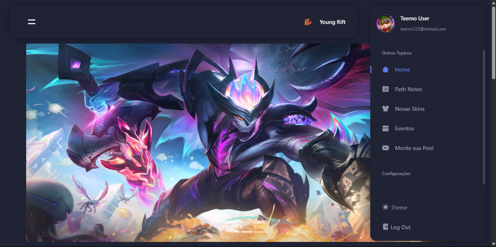
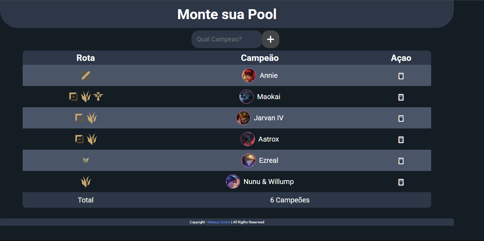

<h1 align="center">Mateus Cimini Araújo</h1>

Desenvolvedor Full Stack em formação — construindo projetos práticos e responsivos com foco em aplicações reais.

---

## 👨‍💻 Sobre mim

Sou um desenvolvedor em formação, atualmente em transição de carreira e estudando de forma intensa para atuar como **desenvolvedor full stack**. Tenho focado em projetos que simulam aplicações reais para aplicar o que aprendo em **HTML, CSS, JavaScript** e ferramentas modernas do ecossistema web.

Busco minha primeira oportunidade na área, com interesse em ambientes colaborativos onde possa crescer como profissional e contribuir com soluções de qualidade.

---

## 🧰 Tecnologias que uso

---

## 🧠 Atualmente estudando

---

## 📈 Nível de conhecimento (autoavaliação)

| Tecnologia        | Nível           |
|-------------------|------------------|
| HTML / CSS        | ✅ Bom           |
| JavaScript        | ✅ Intermediário |
| jQuery            | ✅ Intermediário |
| Bootstrap         | ✅ Intermediário |
| SASS / LESS       | 🔄 Aprendendo    |
| Gulp / Grunt      | 🔄 Aprendendo    |

---

## 🧪 Projetos em destaque

### 🎮 [YoungRift](https://young-rift.vercel.app/)
Portal fictício de notícias sobre Wild Rift com múltiplas páginas, tema escuro, modais, toasts, sidebar e minigame.

>   
> [🔗 Repositório](https://github.com/Mateus-Cimini/YoungRift)

---

### 📱 [Linkado](https://linkado-ten.vercel.app/)
Repositório pessoal de links com cards personalizados, backup via JSON e gerenciamento intuitivo no navegador.

>   
> [🔗 Repositório](https://github.com/Mateus-Cimini/Linkado)

---

### 🧩 [montandoSuaPool](https://montando-sua-pool-6tvh.vercel.app/)
App simples para montar sua pool de campeões, escolhendo a partir de uma lista com pesquisa, tabela dinâmica e contagem total.

>   
> [🔗 Repositório](https://github.com/Mateus-Cimini/montandoSuaPool)

---

## 📫 Contato

- 📧 E-mail: [mateusmateus122333@gmail.com](mailto:mateusmateus122333@gmail.com)  
- 📱 WhatsApp: (33) 99808-7393

---

📌 Status atual

🧑‍🎓 Estudando desenvolvimento Full Stack  
📚 Criando projetos práticos para portfólio  
📩 Disponível para entrevistas e testes técnicos  

